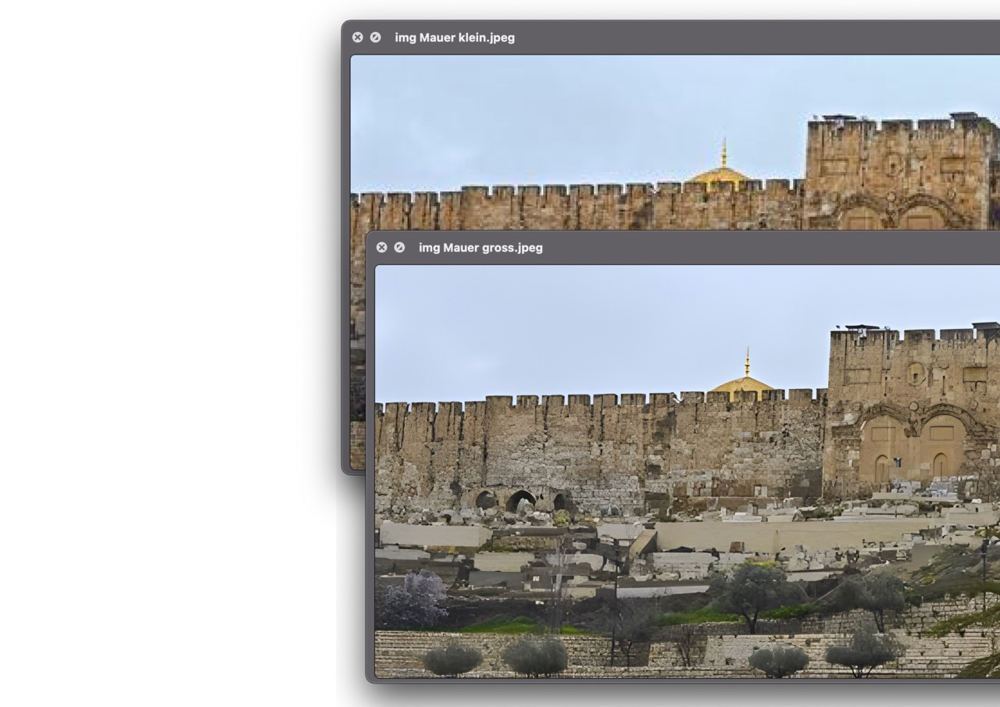
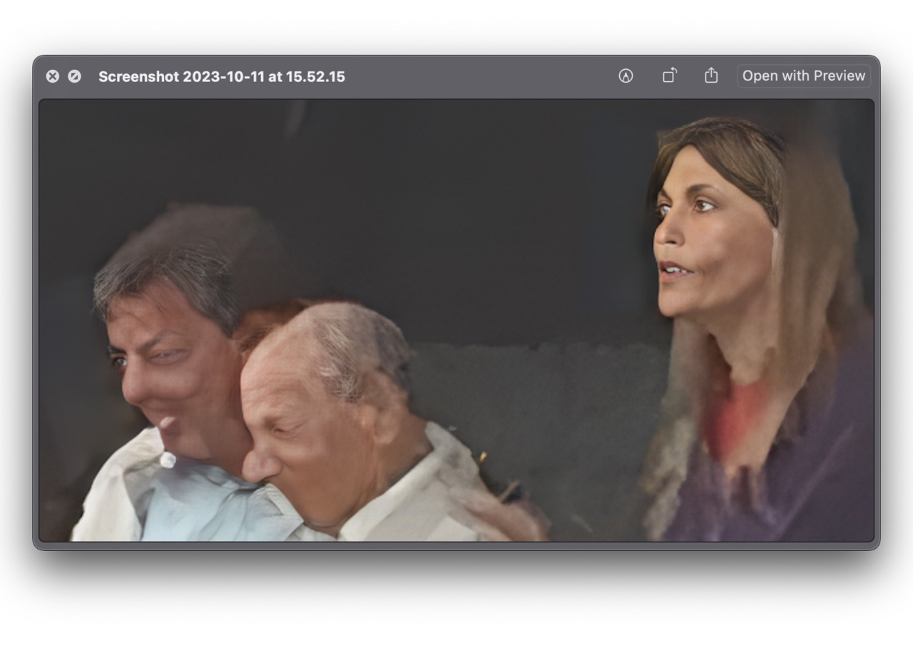

+++
title = "upscale AI "
date = "2023-10-12"
draft = false
pinned = false
tags = ["notiz", "AI"]
image = "1-large.jpeg"
description = "Die Lösung für pixelige Bilder?"
+++
Im Rahmen eines kleinen Website-Projekts stosse ich auf ein Problem. Einige Bilder auf der Start-, Kontakt- und anderen Seiten sind extrem pixelig. Ich habe nach einer Lösung gesucht und bin auf eine Open-Source-KI gestossen, die Bilder vergrößern kann. Wenn Linien im Bild erkennbar sind, fällt es der KI leicht, die fehlenden Pixel zu interpretieren. (Beispiel: Bild Mauer) Bei Bildern von Menschen und Gesichtern hat die KI nicht so gut funktioniert. (: [hier](https://replicate.com/nightmareai/real-esrgan)

