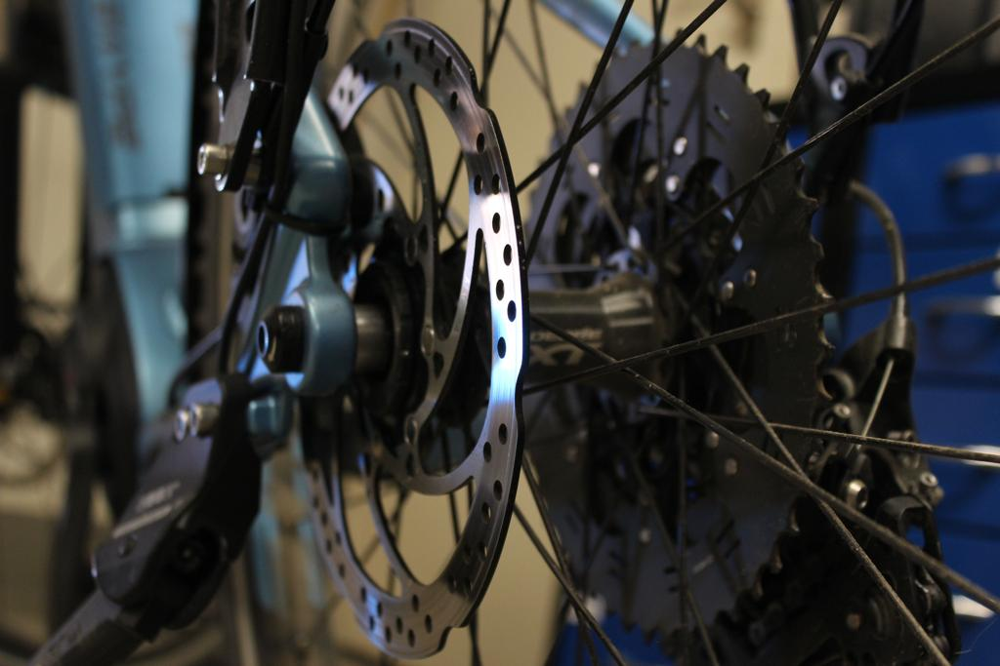
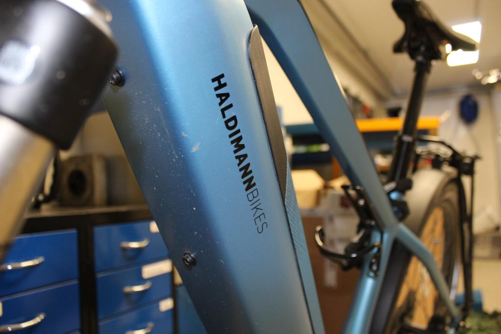

+++
title = "Ich schnuppere Velomech"
date = "2021-04-07"
draft = true
pinned = false
image = "d93e01e3-15c1-4ec2-bef9-c9bcafb6f161.jpg"
description = "Ich war vorletzte Woche zwei Tage bei einem Velomech und schreibe darüber."
+++
Ich habe mir überlegt was ich einmal schnuppern gehen möchte und bin auf den Beruf Velomech gekommen. Da mein Onkel ein Velolanden eröffnet hat und er dazu auch einen Mech angestellt hat, bat sich das natürlich an. Also habe ich mich mit ihm in Verbindung gesetzt und einen Termin abgemacht. Meine Idee war es, dass ich einen kurzen Imagefilm für drehen könnte. Am Montag fuhr ich also auf Grosshöchstetten. Jetzt will ich in diesem Blog aufschreiben was mir gut und was mir weniger gefiel an der Arbeit als Velomech.

Ich habe den Auftrag von meinem Onkel erhalten, Fotos für sein [Instagramm](https://www.instagram.com/haldimannbikes/) zu machen. Drei Fotos sind hier im Blog.

Pro

\-Es ist etwas was man im Altag auch brauchen kann.\
-Man sieht, was man gemacht hat.\
-Man hat Kontakt mit Kunden\
-Man muss manchmal auch improvisieren

Contra 

\-Es ist nicht mega abwechslungsreich weil ein Bike eher ein Baukasten ist.\
-Es ist nicht mega eine kreative Arbeit obwol man auch improvisieren muss.\
-Im Winter ist es oft so, dass Velogeschäfte sich der Jahreszeit anpassen und auf Skierwechseln.\
-Es gibt immer wieder stressige Situationen, in der man in einer gewissen Zeit etwas erlediegen muss.

Fazit:

Ich würde sagen, das es ein wirklich spannender Job ist und das Arbeiten meistens Spass macht. Denoch ist der Job eher nichts für mich da mir da die Kreativität ein wenig fehlt.