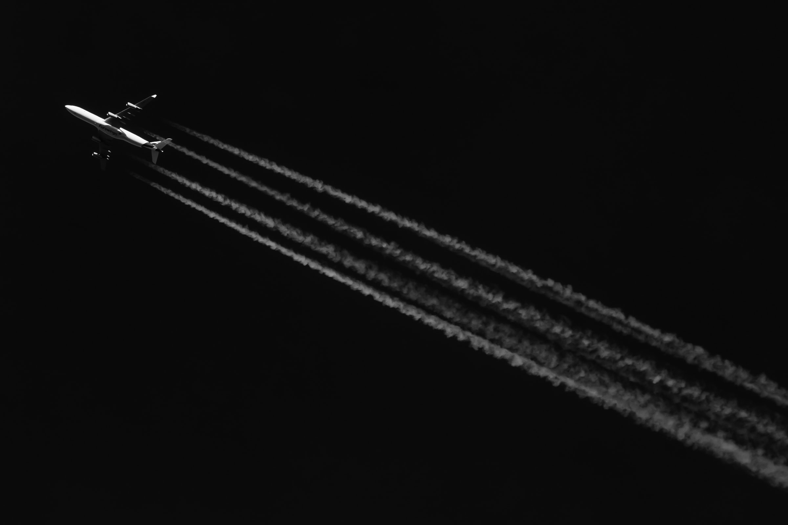

+++
title = "Verschwörungen"
date = "2020-12-02"
draft = true
pinned = false
image = "thought-catalog-gbq3esfsdg8-unsplash.jpg"
description = "Verschwörungstheorien sind immer wider im umlauf zu den untrschidlichsten Themen und Bereiche"
+++
## Verschwörungen

Verschwörungen sind überal und es giebt mehr Menschen auf der Welt als man glaubt die an die kreatifsten und die verrücktesten Teorien Glauben. Eine Teorie dreht sich meistens um Macht. Hat fileicht der alte Freimaurerorden die Welt im griff oder die Menschen die die Welt regieren sind in Wirklichkeit Außerirdische Echsenmenschen die die welt übernemen wollen. Es giebt natürlich auch beweisse die aber meistens alles heissen könnten oder mit einer so schlechten Auflösung aufgenomen sind das man fast nichts   erkennen kann. Zum beispiel gibt es im Internet verschidene videos in denen man einige verdechtige Augenzeinkern oder eine hervorshcnelende zunge zu erkennen kann.

#### Mondlandungs Fake

Am 21. Juli 1969 betraten die Insasen der Mission Apollo 11 Neil Armstrong und Buzz Aldrin als ersten Menschen den Mond. Aber das ist alles nur eine schrekliche Inszenierung und wurde alles nur in einem Studio in Hollowod aufgenommen um bei dem Wetlauf ins all die Nasse vorne zu behalten. Das glauben 20% der Amerikanischen befölkerung. Den es giebt auch beweisse den die szenerie soll angeblich sogar falsch beleuchtet gewesen sein. Und in dem Video siedt man die Amerikanische Flake die Im Wind Flatert. Wind ? aber wind gibt es auf dem Mond doch garnicht. Als ich das kurze[ Video](https://youtu.be/wd6ekSYpt9w) dazu gesehen Habe bin ich auf den Entschluss  gekommen das die Flage warscheindlich einfach geflatert hat weil sie mit Wucht in den Boden geramt wurde. Ich Finde das das die wohl Logiste Teorie meiner aumzählung Ist aber auch die stinkt zum Himmel oder halt zum Mond

####  

#### Die Erde ist eine Scheibe

Früher dachte man das die Erder eine Scheibe ist aber mit der zeit gab es mehrere Teorien und dann wure aus der vermeintlichen Flachen Erde eine runde Kugel. Als Juri gagarin als erster mensch in seiner Raumkapsel Wostok 1 in den Weltraum Flog gab es den vermeintlich unwiderlegbaren beweisse das die Erde eine Kugel ist aber nicht für verschörung teoretiker. Es giebt immer noch eine hand voll Leute die behaubten das die Erde eine kugel ist. Ich habe da natürlich auch nach angeblichen beweisse gesucht aber ich habe keine schotige aufnahmen oder irgendwelche abwegige fackten gefunden. Ich halte die Teorie sehr abwegig warum solte sich die Wissenschaft seit dem 15. Jarhunder teuschen.

#### Chemtrails

Jeder hat schon einmahl diese Wolkenändlichen Lienien am Himmel gesehen das sind  in grosser höhe kondensierte Flugzeug Abgasse. Aber diese streifen sollte es angeblich garnicht geben. Da gibt es natürlich nur eine Erklärung die Regirung fült heimlich die Tanks mit gass und Sprüht es so in die Atmosfähre. Angeblich sollen diese Gifte die Gesundheit bewinflussen und sogar das Klima verändern können. Beweisse gibt es nich aber warum sollte ich dan daran glauben. Ich halte wie man warscheindlich schon rausgehört hat nichts von diesser Teorie.

Ich bin von sollchen Teorien eher Abgelent und halte eigentlich nichts davon. wir stossen aber immer wider darauf. Forallem in der Corona zeit sind immer wider Verschwörungsteorien in umlauf. Fiel