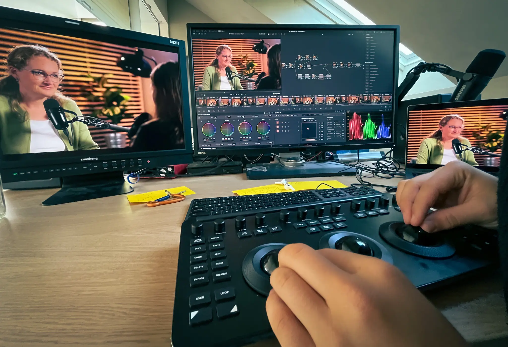
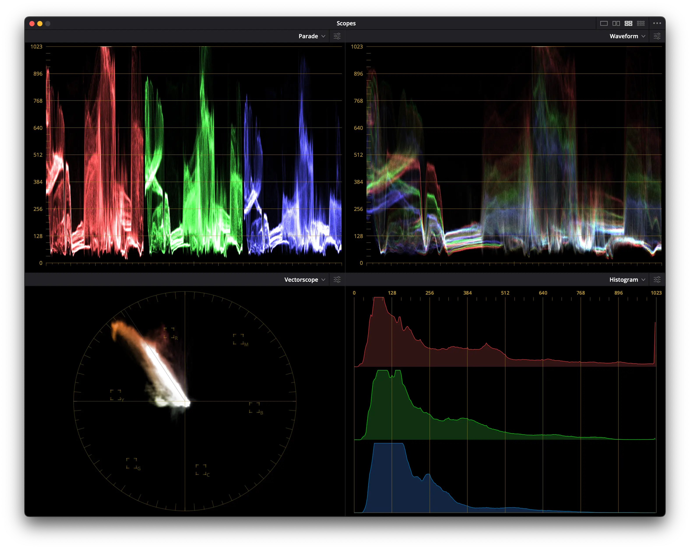

+++
title = "Was ich über Color Grading gelernt habe. "
date = "2024-10-22"
draft = false
pinned = false
image = "img_1794.webp"
description = "Was ich über Color Grading gelernt habe. "
+++
Mediamatiker ist ein unglaublich vielfältiger Beruf. Eigentlich findet fast alles, was man kreativ am Computer machen kann, dort seinen Platz. Jedes dieser Gebiete ist wiederum sehr facettenreich und erlaubt es, tief oder weniger tief einzutauchen. Im Effinger haben wir die Möglichkeit, bei bestimmten Themen richtig in die Tiefe zu gehen. Da ich mich besonders für das Videomachen interessiere, habe ich hier Glück, denn im Effinger haben wir Profis auf diesem Gebiet.

Gerade haben wir wieder eine Situation, in der wir davon profitieren können. Bei einem unserer Podcasts ist nämlich ein Fehler beim Colorgrading passiert – die Hauttöne sind etwas zu rot geworden. Also habe ich Fäbu gefragt, ob er mal Zeit für ein Coaching hat. Hatte er. So konnten wir das ganze Problem mit ihm besprechen, und es wurde schnell komplizierter, als ich gedacht hatte.

Mit einem von Fäbus Profi-Colorgrading-Monitoren haben wir uns an das Problem gemacht. Schnell habe ich gelernt, dass Farben ein Thema sind, bei dem viele Faktoren mitspielen. Einer davon ist, dass jeder Bildschirm sein eigenes Farbprofil hat. Daher können Farben, die auf einem Monitor gut aussehen, auf einem anderen ganz anders dargestellt werden. Von Fäbu habe ich gelernt, dass es Sinn macht, Aufnahmen immer auf möglichst vielen Bildschirmen anzusehen und zu versuchen, es sozusagen allen recht zu machen. Wirklich faszinierend war es, als ich das gleiche Grading auf drei unterschiedlichen Monitoren gemacht habe und alle komplett anders aussahen.

Es gibt jedoch noch mehr, das schiefgehen kann. Farben werden auf Monitoren mit Farbprofile geregelt. Darauf ist festgelegt, wie die Farben dargestellt werden sollen. Jeder kann sie auf dem eigenen Gerät einstellen, die meisten machen das aber nicht. Beim Erstellen von Videos läuft das etwas anders, da man oft in die Situation kommt, beim Export ein Preset einstellen zu müssen. Jetzt kann es aber sein, dass das Preset in DaVinci anders ist als das, das beim Export verwendet wird. Daher kann es passieren, dass die exportierte Aufnahme einen sogenannten Colorshift hat – das Bild in DaVinci sieht also anders aus als die exportierte Version.

Das ist aber nur ein kleiner Teil von dem, was man über Colorgrading lernen kann. Denn der grösste Teil ist natürlich das Anpassen der Farben. In DaVinci macht man das mit Nodes, das heisst, man kann kleine Blöcke aneinanderreihen, die man dann verbindet oder mit komplizierten Verbindungen trennt und wieder verbindet. Auf jeden Block kann man dann eine Einstellung legen: White Balance, Vignette, Kontrast ... was auch immer. DaVinci liefert da auch mega viele Tools für das Manipulieren der Farben, das Auswählen bestimmter Farbbereiche oder KI-Tools zum Reduzieren von Rauschen in dunklen Flächen.

Auf der einen Seite hat man dann einen Viewer, auf dem man das Bild sieht; damit ist es möglich, Anpassungen zu machen und zu schauen, ob das Bild so gut aussieht. Es gibt auch spezielle Colorgrading-Monitore, die die Farben dann möglichst "echt" darstellen können. Aber wenn man das nicht hat, können Bildschirme – wie wir oben schon gelernt haben – täuschen. Darum arbeitet man auch oft mit Diagrammen wie dem Waveform-Monitor oder dem Vektorskop. Was erst mal sehr verwirrend aussieht, ist echt praktisch. Diese Diagramme brechen das Bild nämlich in verschiedenste Bereiche auf und können viele Infos geben: Wo sind die dunkelsten Stellen im Bild, gibt es helle Flächen, die schon übersteuern, sehen die Hauttöne natürlich aus, und so weiter.

Spannend zu wissen ist auch, dass professionelle Kameras fast immer in einem Log- oder Raw-Format filmen. Das bedeutet, dass sie ein sehr breites Farbspektrum aufnehmen; ohne Bearbeitung sehen diese Bilder dann aber sehr flach und unschön aus. Der Vorteil dabei ist, dass das Bild sehr viele Informationen und eine hohe Farbtiefe hat; auch sehr helle und sehr dunkle Stellen haben noch Details und können ins Bild aufgenommen werden. Ein gutes Beispiel dafür: Wenn man versucht, mit einer billigen Kamera ein Bild vom Himmel mit einer Person im Schatten zu machen, wird man Folgendes feststellen: Entweder ist die Person im Schatten viel zu dunkel, oder die Details wie Wolken fehlen im Himmel, und der Himmel ist einfach eine weisse, überbelichtete Fläche. Dafür sind diese Log-Formate da, denn darin sind alle dunklen wie auch sehr hellen Informationen enthalten.

Der Job von Profis wie Fäbu ist es jetzt, diese flachen Bilder wieder zu schönen Farben zu bringen, Fehler wie zu helle Bereiche im Bild zu korrigieren und gegebenenfalls einen speziellen Look wie Orange-Teal zu erstellen.

Auf der einen Seite konnte ich von Fäbu sehr viel Neues lernen, auf der anderen Seite habe ich aber einfach auch gemerkt, wie viel ich eben noch nicht weiss und wie viel es noch zu entdecken gibt.