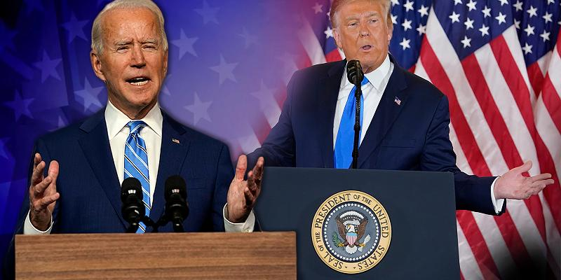

+++
title = "Ein schlechter Verlierer"
date = "2020-11-04"
draft = true
pinned = false
image = "3-format2020.jpg"
description = "Donald Trump sagt selbst von sich, dass er ein schlechter Verlierer ist. \n\nWas wäre, wenn Donald Trump trotz seiner Niederlage das weisse Haus nicht verlassen würde?"
footnotes = "Wikipedia: https://de.wikipedia.org/wiki/Donald_Trump\n\nMrWissen2Go:"
+++
Ich beschäftige mich eigentlich nie mit Politik doch bei diesem Thema wurde ich neugierig.

Ich habe vor kurzer Zeit ein Video gesehen das hies\
[Was passiert, wenn Trump das weiße Haus nicht verlassen will? ](https://youtu.be/EtL5-VJBjx0)\
Es ging darum was passieren würde wenn Donald Trump die Wahl verliert und einfach im weissen Haus bleibt. Ich fasse das Video einfach in schriftlich zusamen:

Donald Trump ist 74 Jahre alt und der aktuelle Präsident der USA. Doch jetzt ist seine Wahl schon 4 Jahre her und es wird Zeit einen neuen Präsidenten zu wählen. Also was wäre wen am 20.01.2021 Joe Binden den frischgewählten Präsidenten der USA einfach verhaftet und Donald Trump kurz danach in einem Pressebericht bekannt gibt, dass Joe Binden verhaftet worden ist und er der President bleiben wird? Wie realistisch ist dieses Szenario? Und ist das überhaubt möglich? 

Unterschiedliche Parteien sagen, dass es möglich wäre. Donald Trump könnte einfach beaupten, dass Binden die Wahlen malipuliert hat. Dennoch ist es logischer, dass Trump versucht die Wahlen zu malipulieren, denn die Mehrheit der Amerikaner steht nicht oder nicht mehr hinter Donald Trump. Donald Trump hat in seiner Amzteit gegen einige Gesetze verstossen aber weil er der Präsident ist, ist er unantastbar und er muss also die Gesetze noch so ändern, dass das auch so bleibt. Darum ist es ihm sehr wichtig, dass er so lange wie nur möglich Präsident bleiben kann.

Das sind natürlich nur Spekulationen. Wir werden ja sehen, in welche Richtung sich das ganze entwickelt.