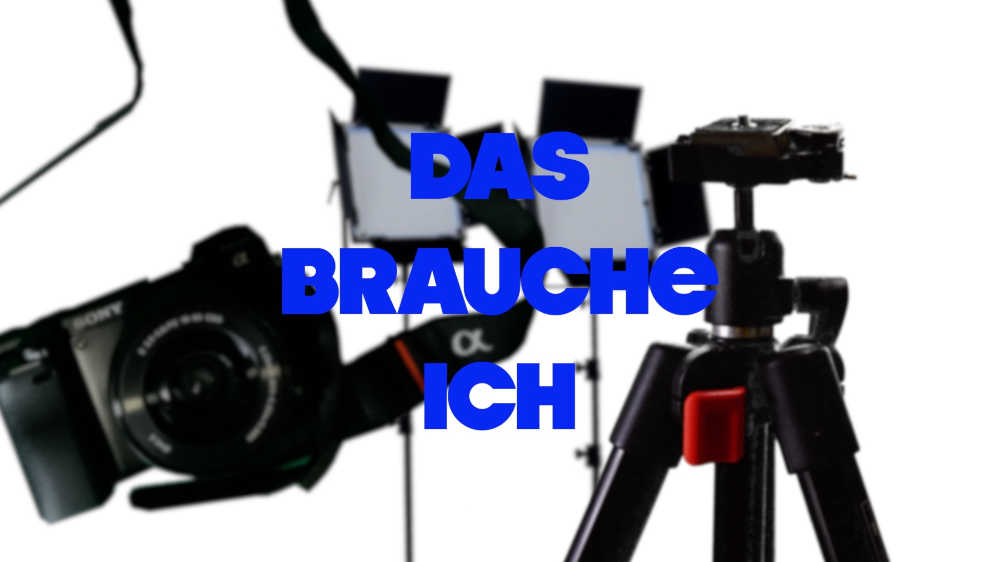
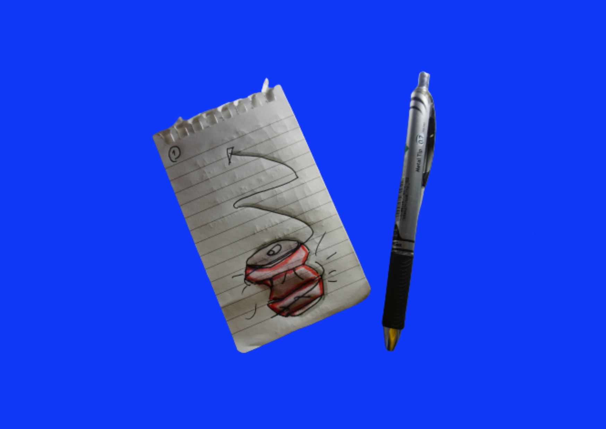

+++
title = "Werbe-Video in 1h"
date = "2022-05-09"
draft = false
pinned = false
image = "werbe-video.png"
description = "Schafe ich es in 1h ein Werbe-Video zu filmen?"
+++
Vielleicht kennt jemand von euch Daniel Schiffert.

Er hat mich inspiriert, diesen Blog zu schreiben. Also genauer gesagt ein bestimmtes Video zu drehen über das ich jetzt schreibe.

Daniel Schiffert macht Werbevideos und zeigt auf Youtube wie er das macht. Etwas hat mich besonders inspiriert. Eine Art die er practical effects nennt. Die Idee dabei ist, dass man richtige Aufnahmen filmt und die dann im Nachhinein mit basic schneid skils in die Position bringt, in die man sie haben will. Ich merke gerade, dass das relativ schwierig zu erklären ist. Ich lasse lieber den Profi reden. \
\
<iframe width="560" height="315" src="https://www.youtube.com/embed/zihOC7Cl370" title="YouTube video player" frameborder="0" allow="accelerometer; autoplay; clipboard-write; encrypted-media; gyroscope; picture-in-picture" allowfullscreen></iframe>

Ich habe mir eine Challenge gestellt. Kann ich in einer Stunde auch so ein Produkt-Video machen?

Ich habe schon ein bisschen herum experimentiert und eine Cola Werbung gemacht.\
\
<iframe width="560" height="315" src="https://www.youtube.com/embed/dAfJNwgeEUA" title="YouTube video player" frameborder="0" allow="accelerometer; autoplay; clipboard-write; encrypted-media; gyroscope; picture-in-picture" allowfullscreen></iframe>

Das brauche ich:

Ich schreibe das jetzt gerade, bevor ich mit dem Filmen begonnen habe, darum kann es sein, dass noch das Eine oder Andere dazu kommt. Ich möchte gerne mit meiner Sony a6000 filmen. Dazu habe ich ein Stativ, zwei grosse und eine kleine Lampe, ein Greenscreen, denn ich an einem Gestell befestigen kann und (ganz wichtig) ein Drehteller. 

In den Videos habe ich oft gesehen. dass Daniel Schiffert ein elektrisches Drehteller benützt, damit sich Dinge vor der Kamera drehen. Habe ich nicht. Aber wir haben eine Mikrowelle. Das Drehteller darin wird auch funktionieren.

Ich denke bei solchen kurzen Produkt-Videos ist es vor allem wichtig, dass die Musik passt. Den es soll ein Lifestyle vermitteln und Musik tut das. Darum habe ich angefangen auf Artlist (eine Filmmusikplattform) nach einem coolen Song zu suchen. 

eine Idee ist eigentlich, den Ablauf einer Getränkedose rückwärts abzuspielen. Erste Aufnahme ist, wie die Dose zusammengedrückt wird, einfach rückwärts und slow motion. Die zweite Aufnahme ist das Öffnen und so weiter. Am Ende sieht man die ganze Dose, die sich irgendwie dreht.\
Weiss nicht, ob man meine Beschreibung checkt, aber für mich hilft das. 

Fortsetzung folgt…