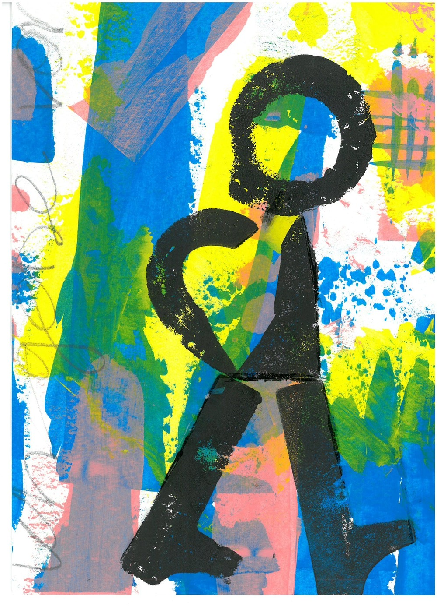
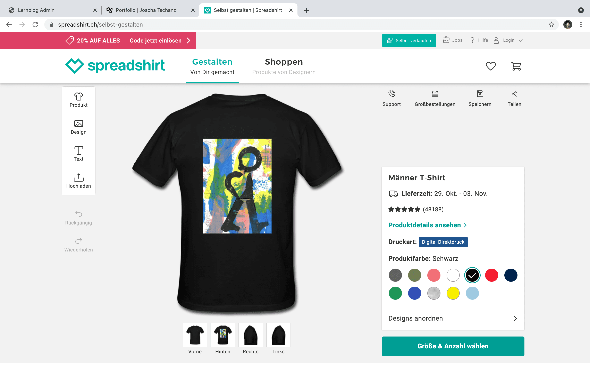

+++
title = "Wie bringe ich mein Designs auf Shirts"
date = "2021-10-25"
draft = true
pinned = false
description = "Wie bekommt man sein eigenen Print auf ein T-Shirt? ich beantworte meine eigene Frage so:"
+++
Regelmäßig darf ich zu einer Künstlerin gehen. Dort entstehen immer wieder coole Bilder. 

Als mein letztes Projekt zu ende ging überlegte ich mir was ich als nächstes machen könnte. Da kam die Idee auf, dass ich meine eigenen Designs auf T-Shirts drucken könnte. Und wie das fast immer bei meinen Projekten ist fing ich viel zu gross an. Ich wollte eine eigene Marke mit einem Logo kreieren und eigene Designs machen die ich dann Verkaufen könnte. Doch wie man es sich denken kann wurde daraus erstmal nichts. Ich merkte schnell das ich zwar viele Ideen hatte aber mir die Skils eindeutig fehlten. Ich wusste nicht auf welchem Program ich das umsetzen wollte und auch nicht wie ich das finanzieren sollte. 

 Ihr fragt euch sicher was das mit meinen Zwei ersten Sätzen zu tun hat.(verbessern)

Als ich gemerkt habe das daraus nichts wurde und ich aber trotzdem ein Ergebnis sehen wollte kam ich auf die Idee das ich das mit einem meinen Colagen umsetzten könnte. Die ich bei dem Atelier, bei dem ich regelmässig bin, gemacht habe.

Ich habe mir dann überlegt wo und wie ich das am einfachsten machen wollte. Wen ich die Kleider verkaufen würde oder einfache eine grössere Auflage bräuchte würde ich mich wahrscheinlich bei einer Druckerei melden oder andere Möglichkeiten suchen. Da ich aber erstmal ausprobieren wollte meldete ich mich bei [Spreadshirt](https://www.spreadshirt.ch/) an. Dort kann man seine eigenen Bilder einfügen, mit Hilfe eines Bildes des Endproduktes bestimmen wo der Print sein soll, die Farbe wählen und am Ende bestellen. Da das am ende natürlich recht teuer wird lohnt es sich sicher nicht wen man es in grosser Auflage machen würde. Wen man aber Kleider, es giebt auch Hoodies, mit eigenem Print haben will ist die Möglichkeit erstaunlich einfach.

Zum Zeitpunkt an dem ich diesen Blog schreibe ist mir noch etwas anderes in den Sin gekommen. Es giebt auch Internetseiten bei denen du dich anmelden kannst und deine eigenen Designs hochladen kannst. Diese Seiten stellen das dann Online und bieten es zum verkauf an. Wen jemand ein Produkt mit deinem Print bestellt, bekommst du einen teil der Einnahmen. Eine Internetseiten die das anbietet ist [redbubble](https://www.redbubble.com/de/explore/for-you/). wie ich erst jezt kapiere macht Spreadshirt das auch. Ich muss das umbedingt mahl ausprobieren.

Mein Shirt ist also angekommen und ich bin zufrieden. Das Projekt ist, wen man es genau nimmt, noch nicht fertig. Denn mein zu anfangs Gesetzes Ziel ist noch nicht erreicht. Da ich aber ein Ergebnis habe kann ich das auch durchgehen lassen. Ich kann mir aber gut vorstellen das ich bei dem T