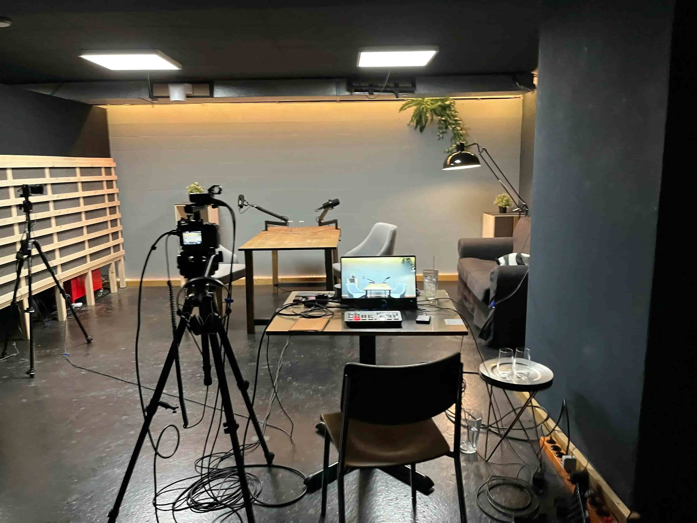

+++
title = "Wir produzieren Video Podcasts "
date = "2024-05-31"
draft = false
pinned = false
image = "img_0189-1-.jpg"
description = "Ich schreibe darüber das wir Podcasts im Effinger Produzieren"
+++
Vor einigen Wochen meldete sich eine Kundin bei YOLU, die gerne Video-Podcasts produzieren möchte. Wir entwickelten einige Ideen: ein Setup in der Hohlkehle, ein Podcast-Studio im 3. OG und so weiter. Allerdings war vieles davon für einen einzelnen Auftrag einfach zu teuer. Also entschieden wir uns, ein permanentes Studio im Effinger Studio zu bauen und Podcasts als offizielles Angebot anzubieten.

Nun hatten wir zwei Wochen Zeit, um einen professionellen Podcast mit Video und Audio aufzunehmen, aber wir hatten noch kein Mikrofon, keinen Ständer, kein Licht, keine Kamera – eigentlich fast nichts. Also setzten wir uns zusammen und überlegten, welches Equipment wir benötigen:

\- 2x a6300 Kameras\
- 2x Objektive\
- 2x Shure MV7 Mikrofone\
- 2x Ständer für die Mikrofone

Die Mikrofone und Ständer waren schnell bei Digitec bestellt und geliefert. Die Beschaffung der Kameras war jedoch ein Auf und Ab zwischen gute Angebote finden, spontan beendeten Tutti-Inseraten, unbeantworteten Anfragen und erfolgreichen Preisverhandlungen. Schließlich kamen die Kameras rechtzeitig an.

Eine Woche vor der ersten richtigen Aufnahme waren wir fast bereit für die Tests. Wir hatten noch nicht die richtigen Objektive und eine Kamera war nicht die endgültige, aber wir konnten den Ablauf für einen Podcast zweimal durchspielen. Aus diesen Testaufnahmen haben wir gelernt und das Setup angepasst. Nach einer neuen Kamera, zwei neuen Objektiven und einigen Umstellungen des Studios hatten wir die erste richtige Aufnahme mit unserer Kundin. Filmen ist für mich immer noch eine angespannte Situation, da die ganze Vorbereitung auf diesen Moment ankommt. Ob die Aufnahmen am Ende so sind, wie sie sein sollten, entscheidet darüber, ob sich das alles gelohnt hat.

Die Aufnahmen waren im Kasten und Mael konnte mit der Bearbeitung beginnen. Nach Colorgrading, Schnitt zwischen den Kamerawinkeln und Audiobearbeitung konnten wir unseren ersten Podcast exportieren und damit abschließen. Wir freuen uns auf viele weitere.

Im letzten Blog habe ich über Druck gesprochen. Diesen habe ich auch hier gespürt, aber ich denke, dass Zeitbeschränkungen helfen, ein Projekt fertigzustellen. Einschränkungen bei kreativen Projekten sind extrem wichtig. Hätten wir Monate Zeit gehabt, um ein Podcast-Projekt zu starten, hätten wir Tage in eine Website, einen Podcast-Hintergrund oder ein Logo investiert. Doch darauf kommt es nicht an und vieles davon ist bei mir eher Prokrastination als sinnvolles Investieren in das Projekt. Am Ende zählt, ob man startet, scheitert und daraus lernt.

